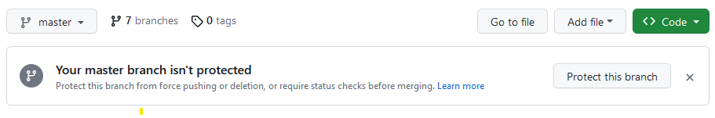

# Classifix (NOTEBOOK)

#### EXPLORE Data Science Academy Classification Predict

## 1) Overview

This project aims to create a machine learning (ML) model that can accurately classify whether or not a person believes in climate change based on their novel tweet data. The challenge, presented by EDSA (Explore Data Science Academy), aims to provide companies focused on reducing environmental impact or offering sustainable products and services with valuable insights into consumer sentiment regarding climate change. By developing a robust and accurate ML model, companies can gain access to a wide range of consumer sentiments from various demographics and geographic categories. This classification solution will enhance their market research efforts and inform future marketing strategies. Understanding how people perceive climate change and whether they consider it a real threat is crucial for these companies to gauge how their products or services may be received in the market.

The project will involve collecting and preprocessing novel tweet data related to climate change beliefs. Features will be extracted from the text data to represent the content in a suitable format for ML algorithms. Supervised learning techniques will be employed to train the model, allowing it to classify tweets as either believing in climate change or not. Evaluation metrics will be used to assess the model's accuracy and robustness. The outcome of this project will be a valuable tool that enables companies to access and analyze consumer sentiment regarding climate change. The insights gained from the ML model's classification results will inform marketing strategies, product development, and communication efforts, aligning them with consumer beliefs and effectively targeting their intended audience.

As part of the predict, we are expected to expand on this base template; increasing the number of available models, user data exploration capabilities, and general Streamlit functionality.

#### 1.1) Problem Statement
The problem at hand is to develop a machine learning model that can accurately classify people's beliefs regarding climate change based on their tweets.
 
The dataset used in this project is collected from Twitter and consists of tweets related to climate change. Each tweet is labeled with one of the following classes:

- 2: News - the tweet links to factual news about climate change
- 1: Pro - the tweet supports the belief of man-made climate change
- 0: Neutral - the tweet neither supports nor refutes the belief of man-made climate change
- -1: Anti - the tweet does not believe in man-made climate change


##### Description of files

For this repository, we are only concerned with a single file:

| File Name                                                | Description   |
| :------------------------------------------------------- | :------------ |
| `Advanced_Classification\DN3_Classifiers_Notebook.ipynb` | Base Notebook |

## 2) Usage Instructions

#### 2.1) Cloning a copy of this repo

| :zap: WARNING :zap:                                                                                  |
| :--------------------------------------------------------------------------------------------------- |
| Do **NOT** fork this repository. Instead follow the instructions in this section to _fork_ the repo. |

As described within the Predict instructions for the Classification Sprint, this code represents a _template_ from which to extend your own work using development branches.



To clone the repo, simply ensure that you are logged into your GitHub account, and then click on the 'Code' button at the top of this page as indicated within the figure above.
copy the _link_ and then navigate to your local machine opening the command line tool of your choice.

To do this, follow the steps below by running the given commands within a Git bash (Windows), or terminal (Mac/Linux):

1.  Clone the _forked_ repo to your local machine.

```bash
git clone https://github.com/1272371/DN3_Classifiers_Model.git
```

#### 2.2) Installing Requirements Packages from requirement file

We recommend setting up a running instance on your own local machine.

1.  Ensure that you have the prerequisite Python libraries installed on your local machine:

```bash
pip install -r requirments.txt
```

2.  Open Jupyter Notebook from this directory.

```bash
jupyter notebook
```

If the web server was able to initialise successfully, the following message should be displayed within your bash/terminal session:

```
To access the notebook, open this file in a browser:
        file:///C:/Users/mncub/AppData/Roaming/jupyter/runtime/nbserver-12516-open.html
    Or copy and paste one of these URLs:
        http://localhost:8888/?token=657a5ac5e674a2e49914be9f49309e6d77454003a39eb2f6
     or http://127.0.0.1:8888/?token=657a5ac5e674a2e49914be9f49309e6d77454003a39eb2f6

```

## 3) FAQ

This section of the repo will be periodically updated to represent common questions which may arise around its use. If you detect any problems/bugs, please [create an issue](https://github.com/1272371/DN3_Classifiers/discussions) and we will do our best to resolve it as quickly as possible.

We wish you all the best in your learning experience :rocket:


